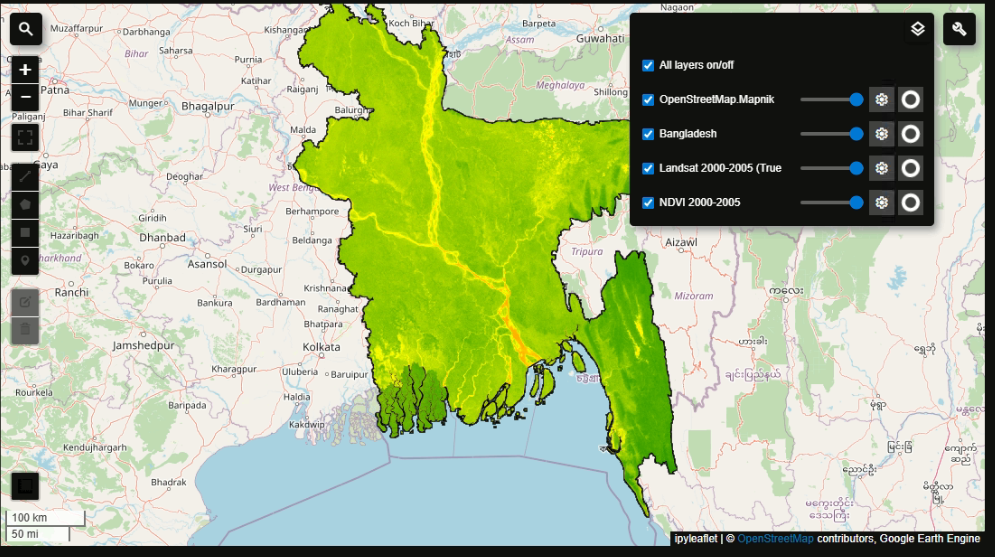
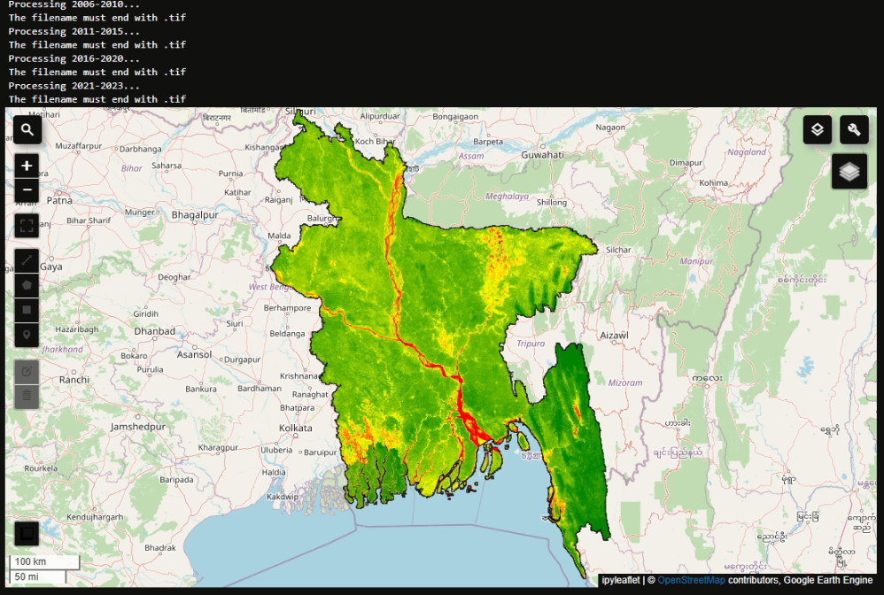
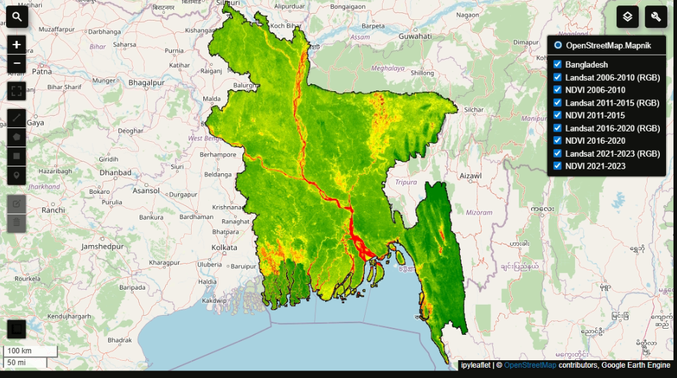
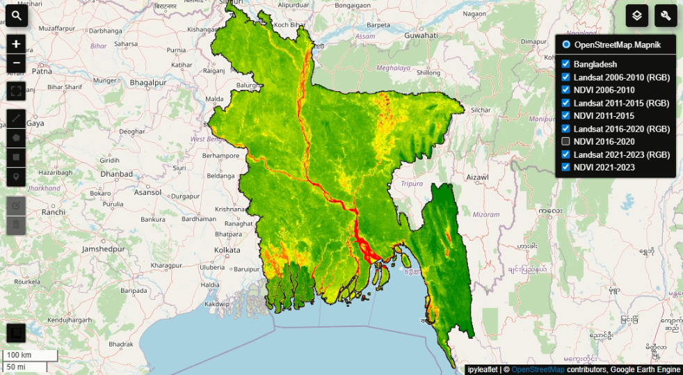
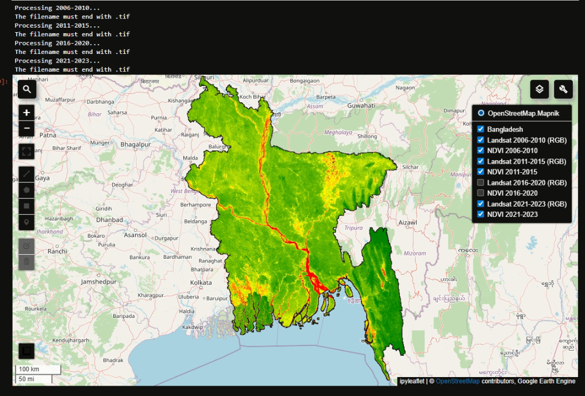

# 🌳 Deforestation Analysis in Bangladesh Using Satellite Imagery (2000–2025)

**Author:** Rakib Hassan  
**Tools:** Python, Google Earth Engine (GEE), geemap, NDVI, Landsat  
**Data:** Landsat 5, 7, 8  
**Time Period:** 2000–2025  

---

## 📷 NDVI Maps (2000–2025)

All exported NDVI images are stored in the Photos/ folder. Green indicates healthy vegetation, red/yellow indicates deforestation or low vegetation.

<div style="display: flex; flex-wrap: wrap; justify-content: center; gap: 15px;">

  <div style="border: 2px solid #ddd; border-radius: 8px; overflow: hidden; width: 300px; text-align: center;">
    
    <div style="padding: 5px; background-color: #f8f8f8;">2000–2005</div>
  </div>

  <div style="border: 2px solid #ddd; border-radius: 8px; overflow: hidden; width: 300px; text-align: center;">
    
    <div style="padding: 5px; background-color: #f8f8f8;">2006–2010</div>
  </div>

  <div style="border: 2px solid #ddd; border-radius: 8px; overflow: hidden; width: 300px; text-align: center;">
    
    <div style="padding: 5px; background-color: #f8f8f8;">2011–2015</div>
  </div>

  <div style="border: 2px solid #ddd; border-radius: 8px; overflow: hidden; width: 300px; text-align: center;">
    
    <div style="padding: 5px; background-color: #f8f8f8;">2016–2020</div>
  </div>

  <div style="border: 2px solid #ddd; border-radius: 8px; overflow: hidden; width: 300px; text-align: center;">
    
    <div style="padding: 5px; background-color: #f8f8f8;">2021–2025</div>
  </div>

</div>


## 🔍 Project Overview

This project analyzes **deforestation trends in Bangladesh** over the last 25 years using satellite imagery and NDVI (Normalized Difference Vegetation Index). By leveraging **Google Earth Engine** and Python libraries like **geemap**, the project:

- Monitors changes in vegetation cover across different regions.  
- Produces NDVI maps for multiple time periods.  
- Identifies areas of vegetation loss.  
- Provides visual insights for environmental planning and conservation.

**Key Features:**  
- Multi-temporal NDVI analysis (2000–2025)  
- Cloud-masked Landsat 5, 7, and 8 imagery  
- RGB and NDVI map visualizations  
- Exported NDVI images stored in `Photos/` folder  
- Ready-to-run Python Jupyter Notebook workflow  

---


## 🛠 Setup Instructions

### 1️⃣ Create a Google Earth Engine Account
1. Go to [Google Earth Engine Sign Up](https://earthengine.google.com/signup/).  
2. Sign in with your **Google account** (an `.edu` email is recommended for academic access).  
3. Accept the terms and wait for account approval.  

### 2️⃣ Install Python & Libraries
1. Install [Python 3.9+](https://www.python.org/) or [Anaconda](https://www.anaconda.com/).  
2. (Optional) Create a virtual environment:

```bash
conda create -n gee_env python=3.10
conda activate gee_env

Install required libraries:

pip install geemap earthengine-api folium jupyter matplotlib numpy pandas

3️⃣ Authenticate Google Earth Engine
earthengine authenticate


Open the link, log in with your GEE account, copy the authorization code, and paste it in the terminal.

In Jupyter Notebook:

import ee
ee.Authenticate()
ee.Initialize()

4️⃣ Run Jupyter Notebook

Navigate to the project folder and start Jupyter Notebook:

jupyter notebook


Open the notebooks:

NDVI(2000-2005).ipynb

NDVI(2006-2025).ipynb

Run the cells to process Landsat imagery and generate NDVI maps.


📂 Folder Structure
Photos/          -> Exported NDVI images
NDVI(2000-2005).ipynb -> Notebook for 2000–2005 NDVI analysis
NDVI(2006-2025).ipynb -> Notebook for 2006–2025 NDVI analysis
DMML.docx / DMML.pdf  -> Documentation files
LICENSE          -> License file
README.md        -> Project description

🚀 How to Run

Clone the repository:

git clone https://github.com/yourusername/Deforestation-Analysis-in-Bangladesh.git
cd Deforestation-Analysis-in-Bangladesh

---